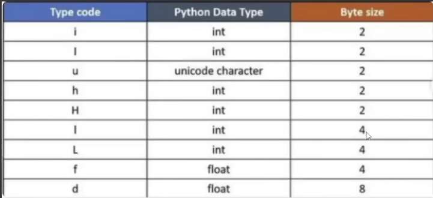

we can use python ARRAY in two ways by importing
    - python array module
    - pyhon numpy module

how much space take by python array

we can iterate any array
we can search any item of the array by indexing and value
we can reverse array by reverse function and slicing
we can copy an array to another variable
we can delete/remove item from any index position by knowing value or index number
we can add any item at the end by append function
we can add any item at any position by insert function
